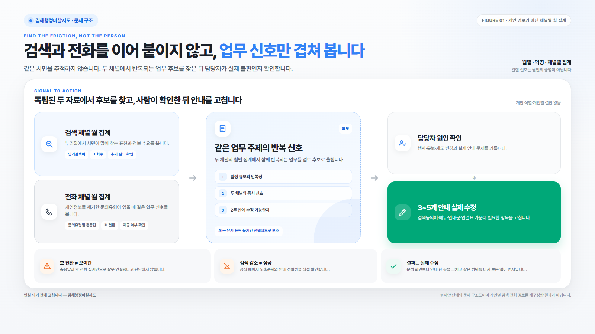
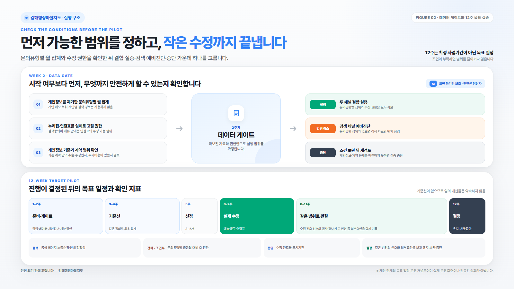

# 2026년 김해시 정책제안 공모전 최종 원고

> 제출 분야: 3-1. 디지털 행정 — 일상을 바꾸는 AI(인공지능) 접목 및 스마트 행정 서비스
>
> 제안 성격: 공개자료에서 확인한 신호로 구성한 12주 목표 실증안이다. 실제 운영에서 나온 성과도, 확정된 사업도 아니다.

## ④ 제안명

**김해행정마찰지도**

부제: 누리집에서 막히는 신호를 찾아 시민 안내부터 고치는 12주 실증안

## ⑤ 주요 내용 — 5줄 입력문안

누리집에서 답을 찾지 못해 전화 문의로 넘어가는 행정마찰 후보를 월별 집계에서 찾는다.  
인기검색어·조회수와 개인정보를 제거한 콜센터 문의유형별 월 집계를 대조한다.  
AI는 시민이 달리 표현한 말을 같은 업무 주제로 묶는 데만 쓴다.  
담당자가 실제 불편인지 확인한 3~5개 항목의 검색·메뉴·안내문·연결표를 고친다.  
12주간 전후 신호를 살핀다. 데이터가 부족하면 검색 채널 예비진단으로 범위를 줄인다.

## ⑦ 현황 및 문제점

정보가 게시돼 있어도 시민이 곧바로 찾는 것은 아니다. 시민이 쓰는 말과 행정용어가 어긋나거나 메뉴가 낯설면 검색이 길어진다. 안내문에 다음 행동이 보이지 않을 때도 마찬가지다. 끝내 답을 찾지 못한 시민은 콜센터로 향할 수 있다. 온라인에서 마칠 수 있었던 일이 전화 상담과 담당부서 연결로 넘어가는 지점이다.

이 제안에서는 이 구간을 ‘행정마찰’이라 부른다. 다만 공개자료만으로 누리집 검색과 전화 문의의 선후 관계는 알 수 없다. 같은 시민의 행동을 연결해서도, 검색을 전화 문의의 직접 원인으로 단정해서도 안 된다. 두 채널의 월별 집계에서 같은 업무 신호가 반복되는지 살핀 뒤 실제 원인은 담당부서가 확인한다.

김해시 누리집에는 기간별 인기검색어와 조회수가 공개돼 있다. 중복 조회나 자동 접속을 거르는 방식은 공개자료에 나와 있지 않다. 김해시 「2024 회계연도 성과보고서」의 민원상담콜센터 민원해결 처리율은 61.6%다. 보고서 산식과 공개된 반올림 수치로 역산하면 호 전환 비중은 약 38.4%다. 여기서 확인되는 것은 총응답과 호 전환 집계의 존재뿐이다. 오이관율이나 누리집 실패율로 읽을 수는 없다.

검색 결과 0건·클릭·재검색, 콜센터 문의유형·최초 이관·재이관 여부도 아직 공개자료에서 확인되지 않았다. 특히 개인정보를 제거한 문의유형별 월 집계 없이는 검색어와 전화 문의가 같은 업무를 가리키는지 대조하기 어렵다. 현재 자료로 가능한 일은 검색 채널 예비진단과 시 전체 호 전환 추세 확인까지다. 두 채널을 묶는 실증은 문의유형별 집계와 실제 수정 권한을 확인한 뒤 시작한다.

## ⑧ 개선방안

김해행정마찰지도는 시민이 쓰는 앱도, 지리정보 지도도 아니다. 공무원이 한 달에 한 번 펴 보는 한 장짜리 개선 점검표다. 업무 주제와 검색·전화 신호, 담당자가 확인한 원인, 수정 내용, 담당부서, 전후 관찰 결과를 한눈에 놓는다. 분석 보고서에서 멈추지 않는다. 실제로 고치고 같은 범위를 다시 확인하는 데까지 관리한다.

점검표는 여섯 단계로 운영한다.

1. 누리집 인기검색어·조회수와 콜센터 총응답·호 전환을 같은 월 단위로 맞춘다. 개인정보를 제거한 문의유형별 집계를 제공할 수 있는지도 확인한다.
2. 2주차에 데이터 게이트를 연다. 문의유형별 집계와 수정 권한이 확보되면 두 채널 결합 실증으로 간다. 문의유형을 확보하지 못하면 검색 채널 예비진단으로 범위를 줄인다. 개인정보나 계약 범위 문제를 해결하지 못하면 실증을 중단한다.
3. 진행이 결정되면 발생 규모, 반복성, 두 채널의 동시 신호, 2주 안에 수정 가능한지를 후보 선정 기준으로 삼는다. 산식과 선정 이유는 점검표에 남긴다.
4. 담당자는 상위 후보가 실제 불편에서 비롯됐는지 확인한다. 행사, 홍보, 제도 변경 때문에 일시적으로 늘어난 검색은 개선 대상에서 뺀다.
5. 검증을 마친 3~5개 항목에서 검색동의어, 메뉴명, 안내문, 자주 묻는 질문, 콜센터 연결표나 상담 매뉴얼을 고친다.
6. 같은 범위의 지표와 외부요인을 다시 보고 유지·보완·중단을 결정한다. 시 전체 호 전환은 배경 추세로만 다룬다. 문의유형별 지표가 있을 때만 해당 수정과 함께 해석한다.

AI가 맡는 일은 표현 정리뿐이다. 개인정보를 제거한 검색어와 문의유형에서 뜻이 가까운 시민 표현을 묶는 보조도구로만 선택해 쓴다. 개인의 검색과 전화를 연결하지 않는다. 호 전환도 오이관으로 판정하지 않으며 상담 메모와 녹취는 분석 대상에서 뺀다. 원인을 확인하고 수정을 결정하는 사람은 담당 공무원이다.

12주는 확정된 사업기간이 아닌 목표 일정이다. 1~2주는 준비 단계로, 담당부서와 데이터 정의, 개인정보 기준, 계약 범위를 확인한다. 3~4주에는 같은 정의로 기준선을 만들고 5주에 3~5개 후보를 고른다. 6~7주에는 메뉴·문구·검색동의어·연결표를 손본다. 8~11주는 같은 범위의 변화 신호를 관찰하는 기간이다. 12주에 유지·보완·중단을 정한다. 검토가 늦어지면 항목 수를 줄이거나 예비진단으로 범위를 낮춘다.

검색량이나 조회수의 감소만으로 성공을 판단하지 않는다. 대상 검색어의 공식 페이지 노출순위와 안내 정확성을 직접 점검한다. 두 지표는 시민의 실제 업무 완료 여부가 아니라 정보에 닿을 가능성을 보는 대리지표다. 문의유형별 집계를 확보하면 해당 유형의 호 전환 건수를 같은 유형의 총응답과 비교한다. 선정일부터 수정 완료일까지 걸린 기간과 실제 개선 완료율도 기록한다. 기준선이 없으므로 임의의 개선률은 약속하지 않는다.

신규 앱이나 대시보드는 만들지 않는다. 공개 조회수, 기존 콜센터 집계, 스프레드시트와 현재 유지관리 절차를 먼저 쓴다. 2026년 누리집 통합 유지관리, 2025년 민원콜센터 상담시스템 재구축, 2025년 데이터 분석 사업의 계약 존재는 확인됐지만 데이터 추출과 소규모 수정이 계약 범위에 포함되는지는 확인이 필요하다. 별도 구축비가 없는 최소형 실증부터 검토한다. 그렇다고 추가비용을 0원으로 단정하지는 않는다.

공개 업무분장을 기준으로 AI정책과 데이터융합팀은 분석 총괄 후보, 정보통신과는 누리집 집계·수정 후보, 소통공보관 시민소통팀은 콜센터 집계·연결표 수정 후보로 둔다. 확정된 역할 배정은 아니며 실제 주관과 협조 범위는 착수 전에 정한다.

## ⑨ 기대효과

시민에게 기대하는 변화는 분명하다. 새 서비스를 익히지 않고도 자신이 쓰는 표현으로 정확한 공식 안내에 닿을 가능성이 커진다. 공식 페이지 노출순위와 안내 정확성을 수정 전후에 점검해 그 변화를 확인한다.

김해시에는 시민이 누리집에서 직접 해결하는 업무와 전문상담이 필요한 업무를 가를 기준선이 쌓인다. 모든 호 전환을 줄이는 것이 아니라, 안내를 고치면 전화 문의 전에 해결 가능한 업무를 찾는 데 목적이 있다.

행정에는 어떤 안내를 왜 고쳤고 이후 어떤 신호가 달라졌는지 기록이 남는다. 효과가 확인된 수정 절차는 다른 부서와 민원업무에도 적용하는 것을 목표로 삼는다. 다만 12주 관찰만으로 인과효과나 시민의 실제 업무 완료를 확정하지 않는다.

## 추가 설명 자료

### 그림 1. 답은 게시됐는데, 왜 전화까지 이어질까

캡션: 검색과 전화가 같은 시민에게서 이어졌다는 뜻은 아니다. 두 자료는 채널별 월 집계 신호다. 김해행정마찰지도는 신호가 함께 반복되는 업무 후보를 찾은 뒤 담당자가 실제 원인을 확인하도록 돕는다.

### 그림 2. 데이터 조건부터 확인해 작은 수정까지 끝낸다

캡션: 문의유형별 집계와 수정 권한이 있어야 두 채널 결합 실증으로 간다. 조건이 부족하면 검색 예비진단으로 범위를 줄인다. 개인정보·계약 문제를 해결하지 못하면 중단한다.

## 근거 자료

1. 김해시, 「2026년 김해시 정책 제안 공모전」 공고 제2026-2919호, 2026. 6. 12.
2. 김해시 인기검색어: https://www.gimhae.go.kr/SmartTrend/modules/searchPopularList.do?setMonth=99
3. 김해시 「2024 회계연도 성과보고서」: https://www.gimhae.go.kr/_res/portal/data/pdf/p09376_down03.pdf
4. 김해시 민원상담콜센터: https://www.gimhae.go.kr/00610/00624/00630.web
5. 김해시 AI정책과 업무분장: https://www.gimhae.go.kr/00954/01023/05797.web
6. 김해시 정보통신과 업무분장: https://www.gimhae.go.kr/00954/01023/01152.web
7. 김해시 용역계약현황: https://www.gimhae.go.kr/00761/00762/00769.web

---

## 제출 직전 확인 — HWP 본문에서 제외

- [ ] 2026년 7월 21일 18시 마감과 정정·연장 공고 여부를 제출 당일 다시 확인한다.
- [ ] 역대 채택·시행 사업 전체에서 동일·유사한 운영모델이 있는지 정책기획과에 확인한다.
- [ ] 누리집의 조회 집계 기준과 검색 결과 0건·클릭·재검색 필드 보유 여부를 확인한다.
- [ ] 콜센터의 문의유형·최초 이관·재이관 필드와 익명 월 집계 가능 여부를 확인한다.
- [ ] 데이터 추출과 검색동의어·메뉴·연결표 수정이 기존 계약 범위에 포함되는지 확인한다.
- [ ] 실제 주관부서와 협조부서, 개인정보 검토 기준을 착수 전에 확정한다.
- [ ] 참가신청서와 개인정보 동의서의 날짜·이메일·동의 표시·자필서명을 완료한다.
- [ ] 최종 HWP를 다시 열어 글자 잘림, 표 이동, 그림 해상도와 페이지 번호를 확인한다.

<!-- HUMANIZE-SUMMARY
원본 글자수: 4,777
윤문본 글자수: 4,793
변경률: 10.09%
카테고리별 탐지: A-6/A-10 번역투·가능형 6→2, C-11 연결어미 뒤 쉼표 10→0, H-3 메타 진입(이는) 4→2, 기계적 기대효과 열거 3→0
자체검증: 6/6 통과
등급: A — S1 잔존 0건, S2 잔존 2건 이하, 수치·날짜·고유명사 보존, 변경률 10~25% 충족
주요 변경 하이라이트:
- “정보가 있다는 것과 시민이 그 정보에 닿는 것은 다른 문제다.” → “정보가 게시돼 있어도 시민이 곧바로 찾는 것은 아니다.”
- “분석 보고서를 만드는 데서 끝내지 않고” → “분석 보고서에서 멈추지 않는다.”
- “AI는 판단자가 아니라 표현을 정리하는 보조도구다.” → “AI가 맡는 일은 표현 정리뿐이다.”
- “첫째·둘째·셋째” → “시민에게·김해시에는·행정에는”
-->
